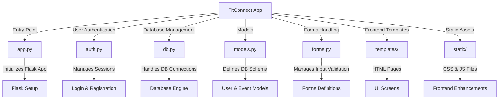

{: .label }
Debra Soth

{: .label }
Lenja Krah

{: .label }
Kira Beyrow

{: .no_toc }
# Architecture

{: .text-delta }

Table of Contents

- [Overview](#overview)  
- [Application Structure](#application-structure)  
- [Core Components](#core-components)  
  - [Backend](#backend)  
  - [Frontend](#frontend)  
  - [Libraries & Dependencies](#libraries--dependencies)  
- [Database](#database)  
- [Codemap](#codemap)  

## Overview

FitConnect is a Flask-based web application designed to connect people with the same fitness goals and interests through event organization. Users can register and manage their fitness profiles. The app also allows users to create, view and participate in fitness events that are organized by other users.

## Application Structure
We follow the Model-View-Controller (MVC) pattern, where models (`models.py`) define the database schema, views (`templates\`) manage the HTML templates and controllers (`app.py`, `auth.py`) handle the request logic. 

The application flow starts when a user sends a request, such as logging in or creating an event. This request is processed by the Flask routes in app.py, and if necessary, data is retrieved from or stored in the database via db.py. The server then returns a response. 

For authentication, users register and log in with hashed passwords, and their sessions are managed through Flask-Login. 

## Core Components

### Backend

For our backend we mainly used Flask and PostgreSQL. 

- `app.py` is the entry point that initializes our app
- `auth.py` manages user authentication, like login, logout and registration
- `db.py` sets up the database connection and intializes the schema
- `models.py` defines the database models including User and Event
- `forms.py` implements WTForms-based validation for user input

### Frontend

For the front-end we used HTML, Bootstrap and Jinja2. These are our templates for user interaction:

- `register.html` lets new users register

- `login.html` allows existing users login to the application

- `accountSettings.html` allows users to update their profile settings

- `personalizeProfile.html` enables fitness and availability customization

- `userOverview.html` displays a list of registered users

- `eventOverview.html` lists all fitness events

- `eventDetails.html` provides event-specific information

- `createEvent.html` allows users to create new fitness events

### Libraries & Dependencies

- Flask-Login for user authentication
- Flask-WTF for Form validation
- SQLAlchemy as Database ORM

### Database:

- `User` Table
- `Event` Table
- Event Participants `event_participants`
    - Join table linking `User` and `Event`
- `UserLikes` Table

## Codemap

*Figure 2: Our Codemap*