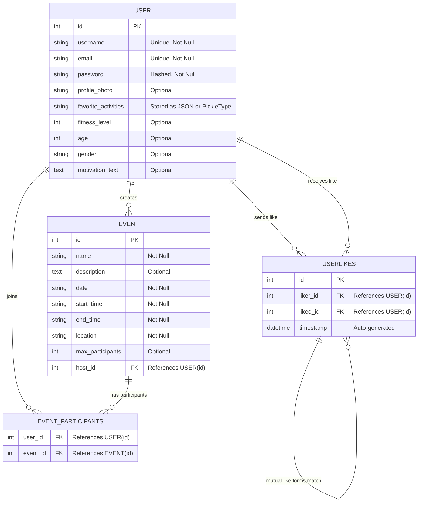
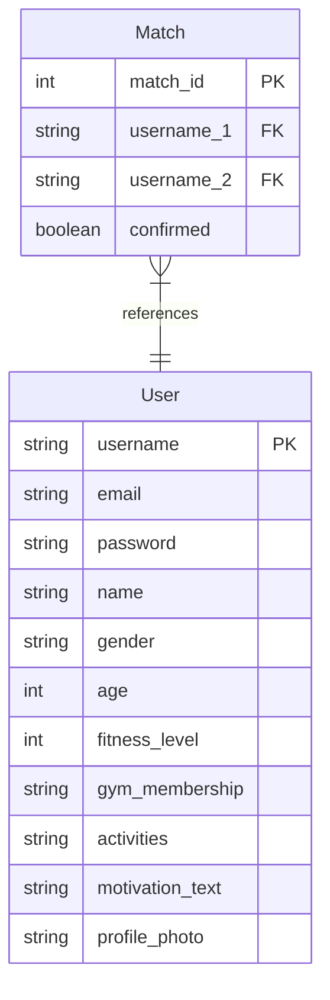

{: .label }
[Debra Soth]

{: .no_toc }
# Data model

{: .text-delta }

Table of contents

+ ToC
{: toc }

## Version 2 (most recent version)

*Figure 4: Updated Datamodel*

In Version 2 of the our data model, we made some key changes to improve how users interact and how events are managed. One of the biggest changes was removing the **Match** table, which previously stored confirmed matches between users. Instead, we introduced the **UserLikes** table, which keeps track of all likes. A match is now simply detected when two users like each other back, rather than being stored separately. This makes the system more flexible and eliminates unnecessary data storage while still allowing users to see their pending likes and confirmed matches.

Another major update is the introduction of the **Event** system. Unlike Version 1, which was focused only on user matching, Version 2 expands FitConnect’s functionality by letting users create, join, and manage fitness events. The new **Event** table stores event details like the name, description, date, time, and location, while the **EventParticipants** table allows multiple users to join the same event. This addition makes FitConnect more social, encouraging group activities and giving users another way to connect beyond just one-on-one matching.

Instead of manually updating a separate **Match** table, the system now checks for reciprocal likes in the **UserLikes** table to determine if a match has occurred. This approach keeps things simple while making it easier to scale and introduce new features in the future. With the addition of events, FitConnect is no longer just about finding workout partners, it has also become a fitness community where users can connect in multiple ways.

## Version 1

*Figure 5: Datamodel version 1*

FitConnect is designed to connect users based on specific criteria such as fitness level, sports, availability and other parameters. 
The data model above consists of two primary entities: **User** and **Match**. 

The table **User** stores the profile of all users. It contains a `username` attribute which serves as the primary key of the table. And it also includes personal data such as name, gender, age and important details for matching like fitness level, preferred activites and optionally a gym membership. 
Through these attributes users can find suitable training partners with similar interests. 

The **Match** table manages the connections between two users who match through the app. Each relationship is uniquely identified by a `match_id`. The foreign keys `username_1` and `username_2` are used to build a direct connection between the two profiles that have matched. The `confirmed` attribute indicates whether or not both users have accepted the connection.

For the **User** table most attributes have the data type string except for `age` and `fitness-level`. Values for `fitness-level` will be saved as 1-10. For the attributes `gender` and `gym-membership` we might change the string to an enum in the next version of the data model to allow for a set of specific values such as "male", "female" or "non-binary" and a set of gym memberships. For `availability`, the data type is currently still a string, however, we might also change this to a structure using boolean instead, where each day of the week (Monday through Sunday) is represented as a separate column with a TRUE or FALSE value. 

In the **Match** table we chose boolean for the attribute `confirmed` to represent whether or not a match happened between two users. TRUE would mean that both users have agreed to the match whereas FALSE would mean that either a user hasn't responded to a like request or the user has rejected the request. Here, we might also explore different data types in the next data model version that might be better fitting.

