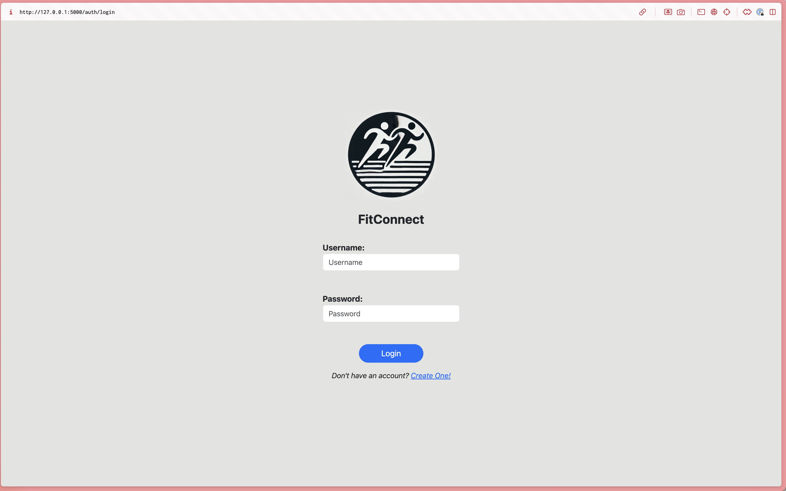
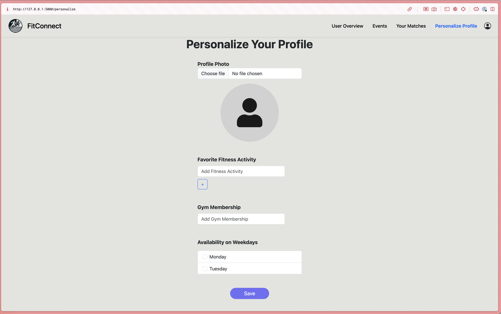
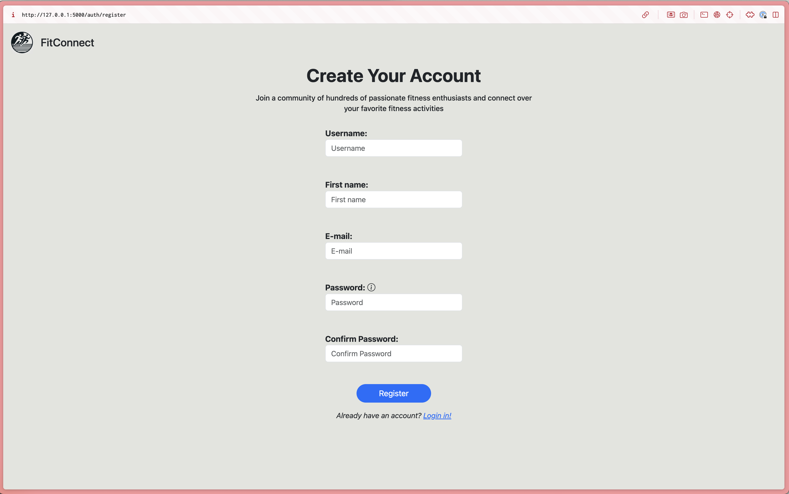
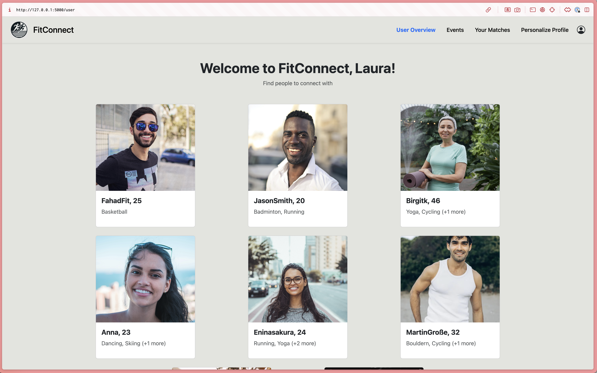
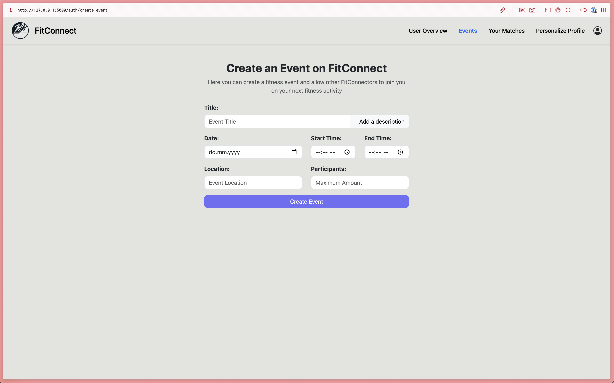
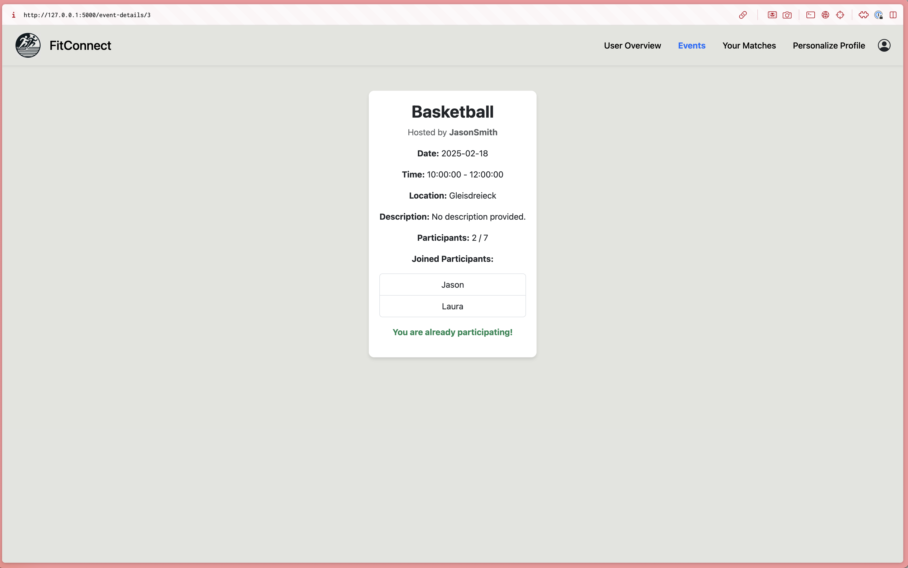
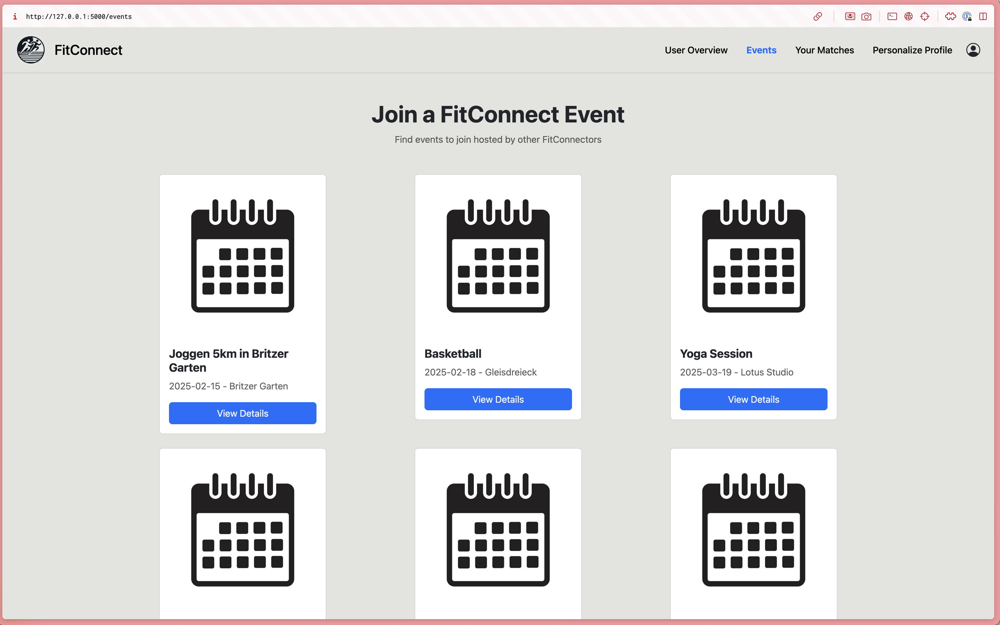
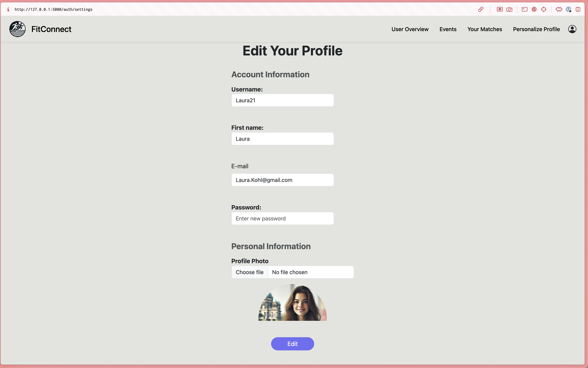
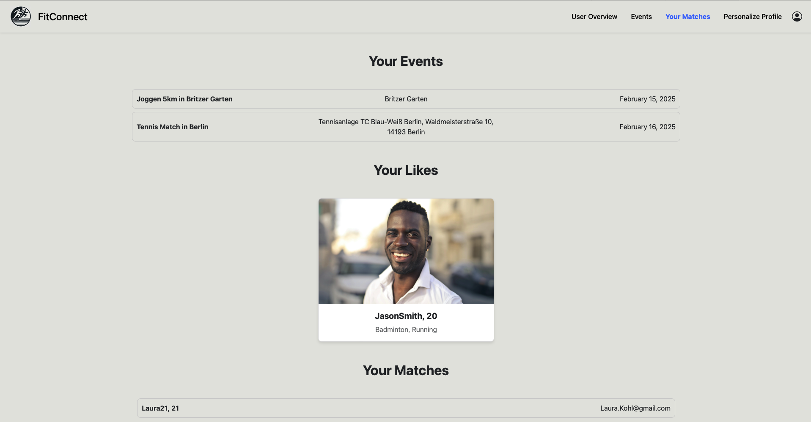

{: .label }
Debra Soth

{: .label }
Lenja Krah

{: .label }
Kira Beyrow

{: .no_toc }
# Reference documentation

{: .text-delta }

Table of Contents

- [Index Page Redirect](#index-page-redirect)  
- [Personalize Profile Page](#personalize-profile-page)  
- [User Registration](#user-registration)  
- [User Login](#user-login)  
- [User Logout](#user-logout)  
- [Create Event](#create-event)  
- [Event Details](#event-details)  
- [Event Overview](#event-overview)  
- [Join Event](#join-event)  
- [Like User](#like-user)  
- [User Profile](#user-profile)  
- [User Settings](#user-settings)  
- [User List](#user-list)  
- [Specific User Profile](#specific-user-profile)  
- [Your Matches](#your-matches)  

## Index Page Redirect
`@app.route('/')`

**Route:** `/`  
**Methods:** `GET`  
**Purpose:** Redirects users to the login page  
**Sample output:** 

*Image 3: Login Page*

---

## Personalize Profile Page

`@app.route('/personalize')`  

**Route:** `/personalize`  
**Methods:** `GET`  
**Purpose:** Renders the profile personalization page with a form  
**Sample output:** 

 
*Image 4: Personalize Profile Page*

---

## User Registration

`@auth.route('/register')` 

**Route:** `/register`  
**Methods:** `GET`, `POST`  
**Purpose:** Handles user registration with form validation and database storage  
**Sample output:** 

 
*Image 5: User Registration Page*

---

## User Login  

`@auth.route('/login')` 

**Route:** `/login`  
**Methods:** `GET`, `POST`  
**Purpose:** Authenticates users and starts a session  
**Sample output:** 

 
*Image 6: Homepage/User Overview Page*

---

## User Logout  

`@auth.route('/logout')`

**Route:** `/logout`  
**Methods:** `GET`, `POST`  
**Purpose:** Logs out the current user and redirects to the login page  
**Sample output:** Redirect to `/login`.  

---

## Create Event

`@auth.route('/create-event')`

**Route:** `/create-event`  
**Methods:** `GET`, `POST`  
**Purpose:** Allows users to create an event  
**Sample output:** 

 
*Image 7: Create Event Page*

---

## Event Details

`@app.route('/event-details/<int:event_id>')`

**Route:** `/event-details/<int:event_id>`  
**Methods:** `GET`  
**Purpose:** Displays details of a specific event  
**Sample output:** 

 
*Image 8: Event Details Page*

---

## Event Overview

`@app.route('/events')`

**Route:** `/events`  
**Methods:** `GET`  
**Purpose:** Shows a list of all available events  
**Sample output:** 

*Image 9: Event Overview Page*

---

## Join Event

`@auth.route('/join-event/<int:event_id>')`

**Route:** `/join-event/<int:event_id>`  
**Methods:** `POST`  
**Purpose:** Allows users to join a specific event  
**Sample output:** Browser shows: `Successfully joined the event!`

---

## Like User

`@auth.route('/like/<int:user_id>')`  
**Route:** `/like/<int:user_id>`  
**Methods:** `POST`  
**Purpose:** Allows users to like another user (for connections/matching)  
**Sample output:** Browser shows: `You liked this user! If they like you back, you'll be matched.`

---

## User Profile

`@app.route('/profile')`

**Route:** `/profile`  
**Methods:** `GET`  
**Purpose:** Displays the profile of the logged-in user  
**Sample output:** 

 
*Image 10: User Profile Page*

---

## User Settings

`@auth.route('/settings')`

**Route:** `/settings`  
**Methods:** `GET`, `POST`  
**Purpose:** Allows users to update their account settings  
**Sample output:** 

 
*Image 11: Account Settings Page*

---

## User List

`@app.route('/user')`

**Route:** `/user`  
**Methods:** `GET`  
**Purpose:** Displays a list of users (for social features)  
**Sample output:** 

 
*Image 12: User Overview Page*

---

## Specific User Profile

`@app.route('/user/<int:user_id>')`

**Route:** `/user/<int:user_id>` 
**Methods:** `GET` 
**Purpose:** Displays the profile of a specific user 
**Sample output:** 

 *Image 13: User Details Page*

---

## Your Matches

`@app.route('/your-matches')`

**Route:** `/your-matches`  
**Methods:** `GET`  
**Purpose:** Displays potential matches based on preferences  
**Sample output:** Profile card displays: `You are already matched`

 *Image 14: Your Matches Page*