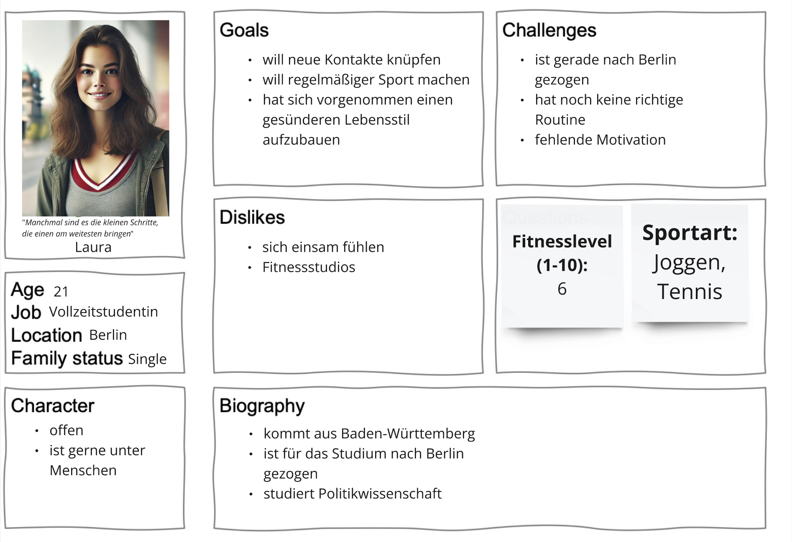
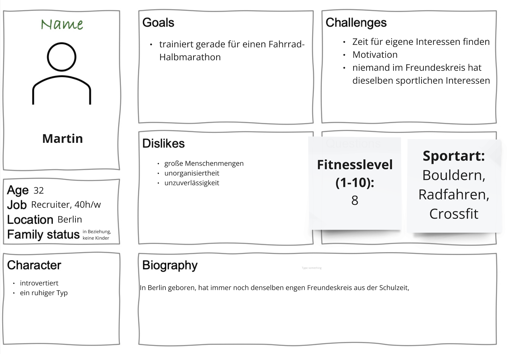
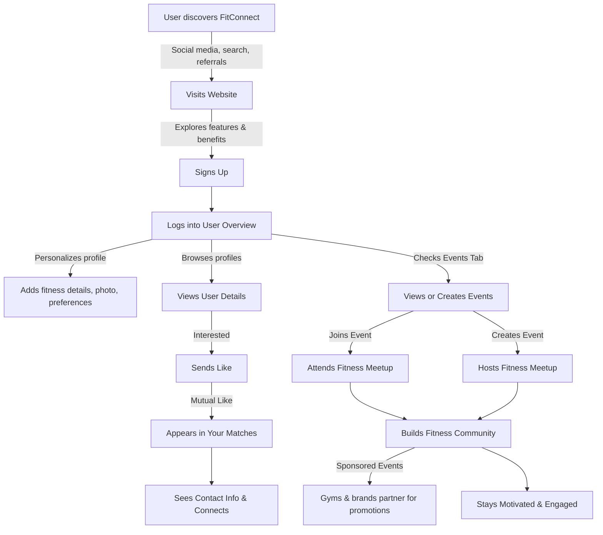

{: .label }
Debra Soth

{: .label }
Lenja Krah

{: .label }
Kira Beyrow

{: .no_toc }

# Value proposition

{: .text-delta }

Table of Contents

- [The Problem](#the-problem)  
- [Our Solution](#our-solution)  
- [Target User](#target-user)  
- [Customer Journey](#customer-journey)  
- [Future Monetization Idea](#future-monetization-idea)  
- [Chart](#chart)  

## The problem

Many people find it hard to stay motivated and consistent with their fitness routines, especially when working out alone. It’s not just about the lack of motivation—loneliness can make it even harder, especially in cities where it’s tough to form real connections. On top of that, finding a workout partner with similar interests and goals can feel overwhelming and time-consuming.

Even when someone does want to work out with others, planning and coordinating sessions often adds extra stress, making it harder to stick to a regular routine. Without structure or consistency, progress slows down, and workouts can become less enjoyable, leading to even less motivation.

## Our solution

Our app is a simple and practical way to help people stay motivated and connected in their fitness journey. It focuses on building a community where users can find training partners with similar goals and interests, making workouts more enjoyable and consistent.

The app features a User Overview, where all registered users are listed. From there, you can check out detailed profiles to find potential training partners. If someone seems like a good match, you can send them a "like." Contact details, like email addresses, are only shared if the other person likes you back, creating a match. This ensures connections are mutual and respectful.

By making it easy to find the right partner and build connections, the app helps tackle loneliness and lack of motivation. While it doesn’t promise to fix everything, it gives users the tools to create better fitness habits and enjoy the process with others. It’s about making fitness more social, simple, and effective.

## Target user

Our target users are individuals of all ages  who are looking to combine fitness with social interaction. They are often people who have recently moved to a new city, such as students like Laura, or those who feel isolated in an urban environment and are open to making new connections. The app aims to attract users who value both the social and athletic aspects of training, helping them find like-minded partners for shared sports activities.

*Image 1: Persona of Laura*

Take Laura as an example: a 21-year-old full-time student who recently moved to Berlin for her studies. She is outgoing, enjoys being around people, and is motivated to lead a healthier lifestyle. However, she struggles with loneliness and lacks a consistent workout routine. The app would help Laura find others who share her interests in jogging and tennis, offering her the chance to meet new people while building healthy habits.

*Image 2: Persona of Martin*

On the other hand, the app also caters to users like Martin, a 32-year-old recruiter who is introverted but dedicated to his fitness goals. Although he prefers smaller social interactions, Martin is looking for reliable training partners who share his interest in activities like bouldering and cycling. The app provides him with a platform to connect with like-minded individuals without the overwhelm of large group settings.

By focusing on this demographic, the app creates an inclusive space for people at various fitness levels and with different social preferences, bridging the gap between fitness and forming meaningful connections.

## Customer journey

The customer journey starts the moment someone first hears about FitConnect—maybe through a social media post, a friend’s recommendation, or a Google search for fitness partners. They click a link, land on the FitConnect homepage, and start exploring.

Once on the login page, they either enter their existing credentials or select “Don’t have an account? Create one!” to register. They fill in their username, name, email, and password, and just like that—they’re in! They land on the User Overview where all registered users are displayed.

Before checking out potential workout buddies, they customize their profile by clicking “Personalize Profile” in the navigation bar. They add details like fitness level, favorite activities, gym memberships, availability, and a profile photo.

Now it’s time to explore! On the User Overview page, they scroll through profiles and click on someone interesting. This takes them to the User Details page, where they can see more about this person — what activities they enjoy, their fitness goals, and whether their schedules align. If they think this could be a good fit, they hit “Send Like” to express interest. But here’s the catch — a match only happens if the other person also sends a like. 

Once they get a mutual match, their new training partner appears in the “Your Matches” tab. From there, they can view their match’s contact information and start a conversation outside of the FitConnect homepage.

There’s also a tab in the navigation bar called “Events”, where users can see fitness events created by others — or create their own. Maybe it’s a local running club, a weekend yoga session in the park, or a group weightlifting challenge at the gym. This feature helps people discover new activities, meet fitness-minded folks, and build a real-world community.

### Future Monetization Idea
In the future, sponsored events could help support the platform. FitConnect could partner with gyms, fitness brands, and health companies to feature their events, giving users access to exclusive group workouts, training sessions, and fitness challenges while providing brands with a way to connect with engaged fitness enthusiasts.

### Chart

*Figure 1: Our Customer Journey Map*